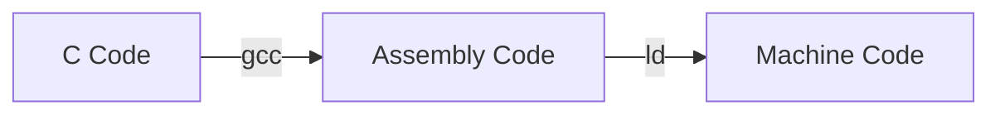

# [ctest](../src/main/scala/ctest)

## C program

`asm` is inline assembly code in C.

`violatile` is used to prevent the compiler from optimizing the code.

In riscv64-unknown-elf-gcc, `unimp` is translated to C0001073.

```asm
CSRRW x0, cycle, x0
```

This code will raise an exception in a normal CPU, because the `cycle` register(0xC00) is read-only.

## Compile



```bash
riscv64-unknown-elf-gcc ./src/ctest.c -march=rv32i -mabi=ilp32 -c -o ./build/ctest.o 
```

> `--target-help` displays target specific command line options.

-c: Compile and assemble, but do not link.

-S: Compile only; do not assemble or link.

```bash
riscv64-unknown-elf-gcc ctest.c -march=rv32i -mabi=ilp32 -S
riscv64-unknown-elf-as ctest.s -o ctest.o
```

## Link

link.ld

```ld
SECTIONS
{
  . = 0x00000000;
  .text : { *(.text) }
}
```

`.` means current address.

`.text` represents the machine language containing the program.

`*` means all the link targets, and `*(.text)` represents any target file's `.text` section.

```bash
riscv64-unknown-elf-ld ./build/ctest.o -b elf32-littleriscv -T ./scripts/link.ld -o ./build/ctest
```

-b: Specify target for following input files

## Hex and Dump

```bash
riscv64-unknown-elf-objcopy ./build/ctest -O binary ./bin/ctest.bin
od -An -tx1 -w1 -v ./bin/ctest.bin > ../../test/resources/hex/ctest.hex
riscv64-unknown-elf-objdump ./build/ctest -b elf32-littleriscv -D > ./dump/ctest.dump
```
